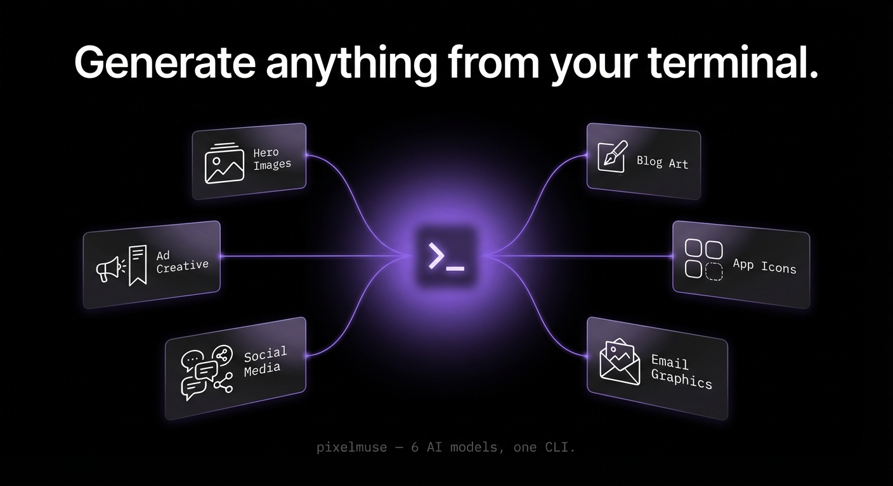

<p align="center">
  
</p>

<p align="center">
  <a href="https://github.com/starmorph/pixelmuse-cli/actions/workflows/ci.yml"></a>
  <a href="https://github.com/starmorph/pixelmuse-cli/actions/workflows/security.yml"></a>
  <a href="./LICENSE"></a>
  <a href="https://nodejs.org"></a>
</p>

<p align="center">AI image generation from the terminal, powered by the <a href="https://pixelmuse.studio">Pixelmuse</a> API.</p>

---

**[Quick Install](#quick-install)** · **[Which Interface?](#which-interface-should-i-use)** · **[Getting Started](#getting-started)** · **[CLI Reference](#cli-reference)** · **[Templates](#prompt-templates)** · **[Config](#configuration)**

Setup: [CLI](#cli) · [MCP Server](#mcp-server-claude-code-cursor-windsurf) · [TUI](#interactive-tui) · [Models](#models)

---

## Quick Install

Clone the repo, then tell your AI agent to set everything up:

```
Claude, install the pixelmuse CLI, pixelmuse TUI, pixelmuse MCP server, and pixelmuse Claude skill globally.
```

Or manually:

```bash
git clone https://github.com/starmorph/pixelmuse-cli.git
cd pixelmuse-cli
pnpm install && pnpm build && pnpm link --global
```

## Which Interface Should I Use?

Pixelmuse ships four interfaces. Pick the one that fits your workflow — they all use the same API and credentials.

| | **CLI** | **TUI** | **MCP Server** | **Claude Skill** |
|---|---|---|---|---|
| **What it is** | Command-line tool | Interactive terminal UI | AI agent tool server | Claude Code prompt template |
| **Launch** | `pixelmuse "prompt"` | `pixelmuse ui` | Auto-starts with Claude/Cursor | Auto-triggers on keywords |
| **Best for** | Scripting, automation, CI/CD pipelines | Visual browsing, exploring models, managing account | Letting AI agents generate images for you | Generating images mid-conversation in Claude Code |
| **Input** | Flags, stdin, pipe, watch mode | Guided wizard with menus | AI decides params from your natural language | Natural language to Claude |
| **Output** | File on disk + terminal preview | File on disk + inline preview | File on disk + JSON response to agent | File on disk + inline preview |
| **Requires** | Terminal | Terminal | Claude Code, Cursor, or Windsurf | Claude Code |

**Rule of thumb:**
- **You type the prompt** → CLI or TUI
- **AI types the prompt** → MCP Server or Claude Skill
- **Quick one-off** → CLI
- **Browsing/exploring** → TUI
- **Part of a coding task** ("generate a hero image for this landing page") → MCP Server

---

## Getting Started

### 1. Create an account

Sign up at [pixelmuse.studio/signup](https://pixelmuse.studio/signup). New accounts include free credits to get started.

### 2. Get an API key

Generate your API key at [pixelmuse.studio/developers](https://pixelmuse.studio/developers). Keys start with `pm_live_`.

### 3. Choose your setup

Pick the setup that matches how you work. All four interfaces use the same API key.

---

#### CLI

Install globally and authenticate:

```bash
pnpm add -g pixelmuse
pixelmuse login
```

Or use an environment variable:

```bash
export PIXELMUSE_API_KEY="pm_live_your_key_here"
```

Generate your first image:

```bash
pixelmuse "a cat floating through space"
```

Requires Node.js 20+. For terminal image previews, install [chafa](https://hpjansson.org/chafa/) (`brew install chafa` on macOS, `sudo apt install chafa` on Ubuntu).

---

#### MCP Server (Claude Code, Cursor, Windsurf)

The MCP server lets AI agents generate images, list models, and check your balance directly — no manual CLI steps needed.

**Claude Code**

Add to `~/.claude/.mcp.json`:

```json
{
  "mcpServers": {
    "pixelmuse": {
      "command": "npx",
      "args": ["-y", "pixelmuse-mcp"],
      "env": {
        "PIXELMUSE_API_KEY": "pm_live_your_key_here"
      }
    }
  }
}
```

If you installed globally, you can use the binary directly:

```json
{
  "mcpServers": {
    "pixelmuse": {
      "command": "pixelmuse-mcp",
      "env": {
        "PIXELMUSE_API_KEY": "pm_live_your_key_here"
      }
    }
  }
}
```

Restart Claude Code. The agent now has access to three tools:

| Tool | What it does |
|------|-------------|
| `generate_image` | Generate an image from a prompt. Accepts model, aspect ratio, style, and output path. |
| `list_models` | List all available models with credit costs and strengths. |
| `check_balance` | Check your credit balance and plan info. |

**Example prompts you can give Claude:**

- "Generate a hero image for my landing page, 16:9, save it to `./public/hero.png`"
- "Create a blog thumbnail about React hooks using the anime style"
- "Make me an app icon, 1:1, save to `./assets/icon.png`"
- "What models are available and how much do they cost?"
- "Check my Pixelmuse credit balance"

**Cursor / Windsurf**

Add to your MCP settings (Settings > MCP Servers):

```json
{
  "pixelmuse": {
    "command": "npx",
    "args": ["-y", "pixelmuse-mcp"],
    "env": {
      "PIXELMUSE_API_KEY": "pm_live_your_key_here"
    }
  }
}
```

---

#### Interactive TUI

For visual browsing, generation wizards, gallery, and account management:

```bash
pnpm add -g pixelmuse
pixelmuse ui
```

---

### Credits

Pixelmuse uses a credit-based system. Each model costs a set number of credits per generation (shown before and after each run). Check your balance anytime:

```bash
pixelmuse account
```

Top up credits at [pixelmuse.studio](https://pixelmuse.studio). See the [API docs](https://pixelmuse.studio/docs/api) for full pricing details.

## CLI Reference

### Generate images

The default command. Just pass a prompt — everything else has sensible defaults.

```bash
# Simple generation — saves to current directory
pixelmuse "a cat floating through space"

# Choose model and aspect ratio
pixelmuse "neon cityscape at night" -m nano-banana-pro -a 16:9

# Save to specific path
pixelmuse "app icon, minimal" -o icon.png

# Apply a style
pixelmuse "mountain landscape" -s anime -a 21:9

# Pipe prompt from stdin
echo "hero banner for SaaS landing page" | pixelmuse -o hero.png
cat prompt.txt | pixelmuse -m recraft-v4

# JSON output for scripting
pixelmuse --json "logo concept" | jq .output_path

# Skip preview, copy to clipboard
pixelmuse "avatar" --no-preview --clipboard

# Open result in system viewer
pixelmuse "wallpaper" -a 16:9 --open
```

### Watch mode

Regenerates automatically when a prompt file changes — ideal for iterating on prompts in your editor.

```bash
pixelmuse --watch prompt.txt -o output.png
# Watching prompt.txt for changes... (Ctrl+C to stop)
# [12:34:01] Saved to output.png (4.1s)
# [12:34:22] Saved to output.png (3.8s)  <- prompt file changed
```

### Browse and manage

```bash
# List available models with costs
pixelmuse models

# View account balance and usage
pixelmuse account

# Recent generations
pixelmuse history

# Open a generation in your system image viewer
pixelmuse open <generation-id>
```

### Commands

| Command | Description |
|---------|-------------|
| `pixelmuse "prompt"` | Generate an image (default command) |
| `pixelmuse models` | List available models with costs |
| `pixelmuse account` | Account balance and usage stats |
| `pixelmuse history` | Recent generations table |
| `pixelmuse open <id>` | Open a generation in system viewer |
| `pixelmuse login` | Authenticate with API key |
| `pixelmuse logout` | Remove stored credentials |
| `pixelmuse template <cmd>` | Manage prompt templates |
| `pixelmuse ui` | Launch interactive TUI |

### Flags

| Flag | Description |
|------|-------------|
| `-m, --model` | Model ID (default: `nano-banana-2`) |
| `-a, --aspect-ratio` | Aspect ratio (default: `1:1`) |
| `-s, --style` | `realistic`, `anime`, `artistic`, `none` |
| `-o, --output` | Output file path |
| `--json` | Machine-readable JSON output |
| `--no-preview` | Skip terminal image preview |
| `--open` | Open result in system viewer |
| `--clipboard` | Copy image to clipboard |
| `--watch <file>` | Watch prompt file, regenerate on save |
| `--no-save` | Don't save image to disk |

### Models

| Model | Credits | Best For |
|-------|---------|----------|
| **Nano Banana 2** (default) | 1 | Speed, text rendering, world knowledge |
| Nano Banana Pro | 3 | Text rendering, real-time info, multi-image editing |
| Flux Schnell | 1 | Quick mockups, ideation |
| Google Imagen 3 | 1 | Realistic photos, complex compositions |
| Recraft V4 | 1 | Typography, design, composition |
| Recraft V4 Pro | 3 | High-res design, art direction |

## Prompt Templates

Save reusable prompts as YAML files with variables and default settings.

```bash
# Scaffold a new template
pixelmuse template init product-shot

# List all templates
pixelmuse template list

# View template contents
pixelmuse template show blog-thumbnail

# Generate with a template, overriding variables
pixelmuse template use blog-thumbnail --var subject="React hooks guide"
```

Templates are stored at `~/.config/pixelmuse-cli/prompts/`:

```yaml
# blog-thumbnail.yaml
name: Blog Thumbnail
description: Dark-themed blog post thumbnail
prompt: >
  A cinematic {{subject}} on a dark gradient background,
  dramatic lighting, 8K resolution
defaults:
  model: nano-banana-2
  aspect_ratio: "16:9"
variables:
  subject: "code editor with syntax highlighting"
tags: [blog, thumbnail, dark]
```

## Configuration

Settings are stored at `~/.config/pixelmuse-cli/config.yaml`:

```yaml
defaultModel: nano-banana-2
defaultAspectRatio: "1:1"
defaultStyle: none
autoPreview: true
autoSave: true
```

### File locations

| Path | Contents |
|------|----------|
| `~/.config/pixelmuse-cli/config.yaml` | User settings |
| `~/.config/pixelmuse-cli/auth.json` | API key (fallback if keychain unavailable) |
| `~/.config/pixelmuse-cli/prompts/` | Prompt template YAML files |
| `~/.local/share/pixelmuse-cli/generations/` | Auto-saved generation images |

## Links

- [Pixelmuse](https://pixelmuse.studio) — Platform home
- [Sign up](https://pixelmuse.studio/signup) — Create an account
- [API keys](https://pixelmuse.studio/developers) — Manage API keys
- [API docs](https://pixelmuse.studio/docs/api) — Full API reference

## License

Business Source License 1.1 (BSL 1.1). See [LICENSE](./LICENSE) for details.

Free for any use except offering a competing image generation API or platform. Converts to MIT on 2030-03-01.

Copyright 2025 StarMorph LLC.
